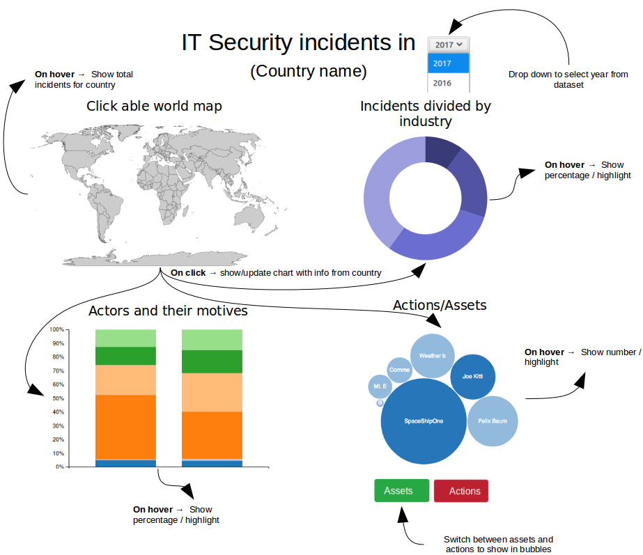
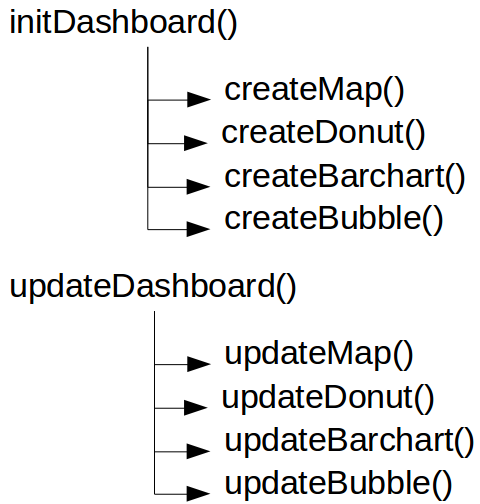
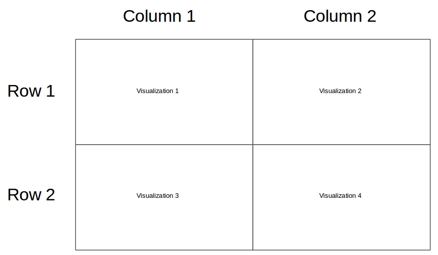

# Design Document  | Minor Programmeren | UvA
## Author
* Mark Pijnenburg

## Comprehensive sketch
The image below shows a more comprehensive sketch relative to the sketch in the proposal document. I clarified which interactivities I want to implement in the visualizations, such as hovering and showing more detailed information.

## Data Source
As mentioned in the project proposal, I am using the [VERIS Community Database (VCDB)](https://github.com/vz-risk/VCDB). The dataset is available on their GitHub. Luckily for me, they have an joined JSON dataset that contains all the information. I do not need to transform the data to another format to use it. Despite this, I may need to map/nest the data so I have the right information to use in my visualizations.

Some information in the dataset is labeled, but in the GitHub is also an labels JSON file that I can use to cross-reference.

The dataset is rather large in raw form. There is some data that is not necessary for this assignment. Before I begin programming the dashboard, I want to remove this information from the dataset. This helps load the page faster and makes the dataset clearer.

## Functions (Script flow)

Because of the size and extensiveness of the project, it is recommended to split the JavaScript file into separate functions. The image below shows the functions and the flow.

### initDashboard()
Overarching function that loads and preprocesses the dataset. The loaded dataset is then ready to use by the successive functions. The default data that is shown when the page is loaded, is the most recent year, 2017.
#### createMap()
Creates the map in the DOM, with the help of the Datamaps external library.
#### createDonut()
Creates the donut char in the DOM with the default year (2017).

#### createBarchart()
Creates the stacked bar chart, in the down-left corner of the page.

#### createBubble()
Creates the bubble chart.

### updateDashboard()
Overarching update function, that is called when an interactive event is triggered. The function can be called so that all visualizations are updated, or only the bubble chart. This because of the toggle element that specifically updates the bubble chart. This update function also prepares the dataset with the right kind of data, so the underlying functions can use it.

#### updateMap()
Updates the map with new data. Only needed when another year is selected from the drop down menu.

#### updateDonut()
Updates the donut chart when a new year is selected or another country selected.

#### updateBarchart()
Updates the stacked bar chart if a new year is selected, or another country clicked on the world map.

#### updateBubble()
Like the other update functions, update the bubble chart when another year or country is selected. Also called when the user clicks the toggle button. This switches the data the bubble chart shows (Actors or actions).

## Code structure/lay-out
### JavaScript
The JavaScript codestructure for this project is quite uncomplicated. I will include the functions mentioned above in one overarching file, main.js. Supportive functions, like mapping of data, counting occurences or determing color with a color scale are placed in a support.js file. The main functionality of the code will be present in main.js, whereas supportive functions will be placed in the support.js file. With this distribution I aim to create clarity and modularity. Later in the project I may divide the code in more files. I will update this design document accordingly.

### HTML
I choose Bootstrap to make my dashboard look nice. It is a famous webpage framework that can be easily used to style an page. Luckily for me, Bootstrap has a built-in [grid system](https://v4-alpha.getbootstrap.com/layout/grid/). My goal is to create a visualization that looks, acts and feels like a dashboard.

The benefit of this gridsystem is that the visualizations are automatically positioned right. As you can see in the image above, I use two rows and columns to display and format my visualizations. All of this will be present in a main HTML file, index.html. This will be the only HTML file present, because I want to include all visualizations on the same page.

## D3 plugins / external libraries
It is possible that not all the D3 plugins are needed, or some other plug to add the wanted functionality. If I want to add a new plugin to this list, I will first consult with an TA.

* [D3-tip](https://github.com/caged/d3-tip)
* [Datamaps](http://datamaps.github.io/)
* [TopoJSON](https://github.com/topojson/topojson)
* [Bootstrap](https://getbootstrap.com/)
* [D3 queue](https://github.com/d3/d3-queue)
