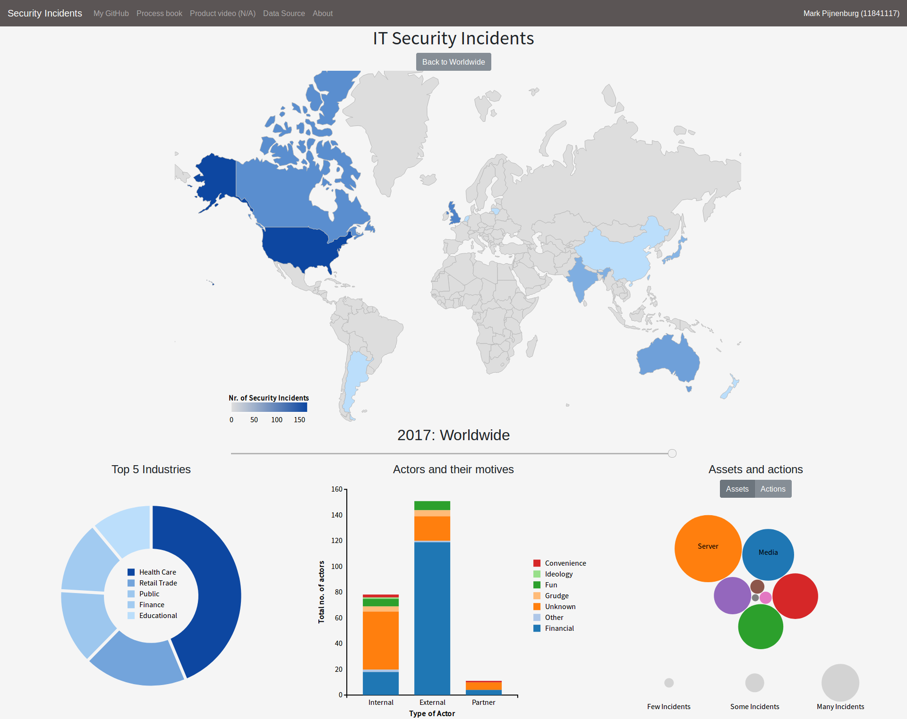
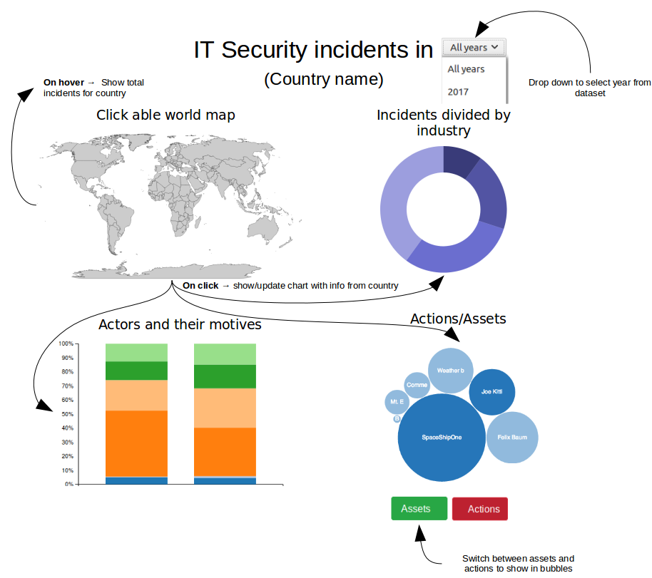

# Visualizing IT Security Incidents  | Minor Programmeren | UvA
[View the D3 dashboard](https://markpijnenburg.github.io/project/)

[Link to product demo](https://vimeo.com/253663261)

## Summary (visualization goals)

The goal of this visualization is to give cyber security experts and people interested in the topic insight into IT security incidents over the past couple years around the world.

This repository contains the final working D3 dashboard, a report, process book and other materials, for assessing the project.

## Acknowledgments
Not everything in this repository is written by myself. The following external code/libraries are used in the final product:
* bootstrap.min.js
* d3.v3.min.js
* d3-collection.v1.min.js
* datamaps.world.min.js
* jquery-3.2.1.slim.min.js
* popper.min.js
* queue.v1.min.js
* topojson.min.js
* underscore-min.js

These files have their own respective licenses. All the external files are located within the [src/javascript/libs](https://github.com/markpijnenburg/project/tree/master/src/javascript/libs) folder.

## Project proposal (Week 1)
### Problem statement
Nowadays, there is a lot going on about cyber security and hacking. Unfortunately there are not many easy to use cyber security visualizations or datasets available. IT professionals specialized in cyber security, or just  interested people, have difficulties to get an easy overview of the topic. They are assigned to closed source visualizations from big security companies, where the source data is not available.

### Solution
This visualization project aims to provide the target audience insight in cyber security around the globe, based on open source data.

**Main Features**
* See total security incidents per country when hovering world map;

  (When clicking a country)
  * Show distribution by industry for country (pie chart);
  * Show the type of actors and their motives for country (bar chart);
  * Show the actions/assets in a bubble chart.

If another country on the map is clicked, the other visualizations are updated with that data. On top of the page there is a drop-down menu to select a specific year from the dataset. The second interactive element is a toggle button, where a user can switch between the data to show in the bubble visualization.

When hovering a country on the map, a tooltip should show with the total number of security incidents of that country.

**Minimum Viable Product**

The world map, pie chart and bubble chart as described above are a minimum viable product. The stacked bar chart is a nice visualization, but I do not know if I am capable to create it.

In total there are two interactive elements. These are the two required interactive components. On top of the page is a drop-down menu to select a specific year from the dataset. The other element is a toggle button to switch the data to show in the bubble visualization.

### Prerequisites
**Data Source**

[VCDB Github](https://github.com/vz-risk/VCDB)

The data is available in JSON, so I do not need to edit the data before using. Possibly I need to map/nest the data within my JavaScript for some visualizations or additional information.

**External Components**

* [D3-tip](https://github.com/caged/d3-tip)
* [Datamaps](http://datamaps.github.io/)
* [TopoJSON](https://github.com/topojson/topojson)
* [Bootstrap](https://getbootstrap.com/)
* [D3 queue](https://github.com/d3/d3-queue)

**Review of similar/related visualizations**

The most cyber security related visualizations represent live attacks around the world, where the majority of them is based on closed source data. (https://www.fireeye.com/cyber-map/threat-map.html)

When there is an world map involved, hovering a country shows more detailed information. Some visualizations are able to show even more information when a country is clicked, whereas some just show a world map with bouncing lines.

Almost everyone uses some kind of JavaScript library, and some even D3. I can do some things in the same way as others do, like the hovering and clicking of a country on a world map.

The thing I mainly miss is a "dashboard" kind of feeling, with multiple visualizations on one page, giving insight about cyber incidents over multiple year. The majority of visualizations is real-time.

**Hard parts to implement**

I have some parts of my visualization idea that prove to be difficult:
* Updating/linking the multiple visualizations;
* Mapping/nesting the data so I could use it for my purpose;
* (Stacked) bar chart and the bubble chart.

Especially the new visualizations I never made during the previous course could be difficult to implement. If the new visualizations tend to be too difficult, I could revert to a normal bar chart. But with the help of the internet and the staff at UvA I could overcome that problem.

The linking/updating/mapping/nesting can be fixed by using the JSON file correctly and implementing the updating via the D3 general update pattern. (Enter, update, exit)

## Author
* Mark Pijnenburg (11841117)
